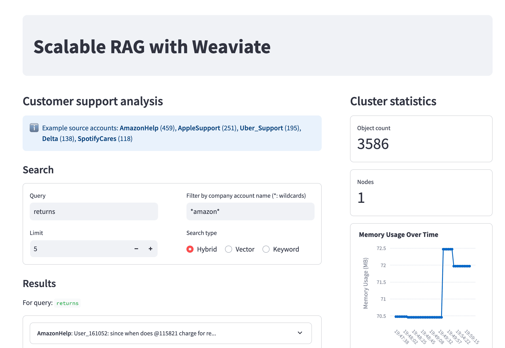

# Scalable-rag-ODSC-eu-2024

README for ODSC Europe training: "How to run scalable, fault-tolerant RAG with a vector database"

> Note: This project was archived after ODSC Europe 2024 and is no longer maintained. Thank you for your interest! Please see the official [Weaviate documentation](https://weaviate.io/developers/weaviate) for the latest information on Weaviate.



# Step 1: Preparation & Setup

Clone this repo and navigate into it. This will be your working directory for the workshop.

```shell
git clone git@github.com:weaviate-tutorials/scalable-rag-ODSC-eu-2024.git
cd scalable-rag-ODSC-eu-2024
```

## 1.1 Install Python & set up a virtual environment

> [!NOTE]
> If you have a preferred setup (e.g. Conda/Poetry), please feel free to use that. Otherwise, we recommend following these steps.

Install `Python 3.9` or higher (e.g. from the [Python website](https://python.org/), or `pyenv`).

Then, create & activate a virtual environment:

```shell
python -m venv .venv  # Or use `python3` if `python` is Python 2
source .venv/bin/activate
```

Check that you are using the correct Python:

```shell
which python
```

This should point to the Python binary in the `.venv` directory.

Install the required Python packages:

```shell
pip install -r requirements.txt
```

> [!TIP]
> If you have network connectivity issues, the installation may time out part way through. If this happens, just try running the command again. It will re-used cached data, so you will make further

> [!TIP]
> If you open new terminal or shell window, you will need to activate the virtual environment again. Navigate to the project directory and run `source .venv/bin/activate`.

## 1.2 Choose your embedding & LLM provider

The workshop is set up for three different embeddings & LLM providers options ([Ollama](#121-option-1-ollama), [Cohere](#122-option-2-cohere), or [OpenAI](#123-option-3-openai)).

We provide helper CLI to download the data & prepare your project for you:

### 1.2.1 Option 1: Ollama

> [!NOTE]
> - Recommended if you have 16+ GB of RAM and a modern computer
> - We will use pre-embedded data for this workshop, so Ollama will be used for vectorizing queries & LLM use
> - No account or API key required

Download & install Ollama from the [Ollama website](https://ollama.com/). Make sure Ollama is running, by:

```shell
ollama -v
```

You should see something like:
```shell
❯ ollama -v
ollama version is 0.3.8
```

Then, run the following command:

```shell
python workshop_setup.py --provider ollama
```

If you have already downloaded the data file, it will use a cached version. To overwrite the file, specify this flag::

```shell
python workshop_setup.py --provider ollama --use-cache False
```

While the download is progressing, you can continue to [the next section (1.3)](#13-install-containerization-tools). Open a new terminal window, and continue along.

### 1.2.2 Option 2: Cohere

> [!NOTE]
> - Recommended if you want to use an API-based solution
> - Cohere account & API key required
>     - Once you have a key, set it as an environment variable: `export COHERE_API_KEY=your-key`
>     - We will use pre-embedded data for this workshop, so the expense will be for queries only & minimal
>     - Still, please set a budget limit in your account for extra safety

```shell
python workshop_setup.py --provider cohere
```

If you have already downloaded the data file, it will use a cached version. To overwrite the file, specify this flag::

```shell
python workshop_setup.py --provider cohere --use-cache False
```

While the download is progressing, you can continue to [the next section (1.3)](#13-install-containerization-tools). Open a new terminal window, and continue along.

### 1.2.3 Option 3: OpenAI

> [!NOTE]
> - Recommended if you want to use an API-based solution
> - OpenAI account & API key required
>     - Once you have a key, set it as an environment variable: `export OPENAI_API_KEY=your-key`
>     - We will use pre-embedded data for this workshop, so the expense will be for queries only & minimal
>     - Still, please set a budget limit in your account for extra safety

```shell
python workshop_setup.py --provider openai
```

If you have already downloaded the data file, it will use a cached version. To overwrite the file, specify this flag::

```shell
python workshop_setup.py --provider openai --use-cache False
```

While the download is progressing, you can continue to [the next section (1.3)](#13-install-containerization-tools). Open a new terminal window, and continue along.

### 1.2.4 RECAP: Embedding & LLM provider

You should have:
- Selected your provider from `ollama`, `cohere` or `openai`.
- Acquired a key if needed, and set it as an environment variable.
- Run the associated command:

```shell
python workshop_setup.py --provider <YOUR_PROVIDER>
```

If the download is going to take *very* long (e.g. more than 10 minutes), maybe stop the download & use a smaller dataset. Do this by adding `--dataset-size 10000` to the end of your command, like:

```shell
python workshop_setup.py --provider <YOUR_PROVIDER> --dataset-size 10000
```

## 1.3 Install containerization tools

### 1.3.1 Docker (Required)

Install Docker Desktop: https://www.docker.com/products/docker-desktop/
Docker will also be used as a container runtime for Minikube.

### 1.3.2 Minikube & Helm (Recommended)

For running Weaviate in a Kubernetes cluster, you can use Minikube & Helm.

Minikube (https://minikube.sigs.k8s.io/docs/start/)
Helm (https://helm.sh/docs/intro/install/)

You will get the most out of the workshop if you have Minikube & Helm installed.

Now, you are ready to start running Weaviate!

> [!NOTE]
> If you are waiting, you can check out the introductory materials. Take a look at the slide deck PDF, or the `intro_workshop.ipynb` notebook.

# Part 2: Cluster setup

This workshop is designed for you to use kubernetes. But you can also just use Docker. For Docker instructions, go straight to [section 2.2](#22-docker).

> [!NOTE]
> This is not an actual production setup. But, we can approximate a production set-up by using a local cluster and using Kubernetes to orchestrate our local cluster, just like we would a cluster in production.

## 2.1 Minikube & Helm

### 2.1.1 Set up the cluster

Update helm chart & add the Weaviate repository:

```shell
helm repo update weaviate
helm repo add weaviate https://weaviate.github.io/weaviate-helm
```

Get the default values:

```shell
helm show values weaviate/weaviate > values-default.yaml
```

This file shows you the set of available options for the Weaviate helm chart. (Optionally - take a look at the file with your favorite text editor.)

You could edit this file, or create a new one with just the values you want to change.

We will use a pre-configured values file (`values.yaml`) that sets up a single-node Weaviate cluster.

Start a small cluster with Minikube:

```shell
minikube config set memory 2048
minikube start --nodes 1
```

### 2.1.1 Install Weaviate onto our cluster

Install Weaviate:

```shell
kubectl create namespace weaviate
helm upgrade --install "weaviate" weaviate/weaviate --namespace "weaviate" --values ./values.yaml
```

Check the status:

```shell
kubectl get pods -n weaviate
```

Shortly, you should see the Weaviate pods running. This should take about a minute.

```shell
❯ kubectl get pods -n weaviate
NAME         READY   STATUS    RESTARTS   AGE
weaviate-0   0/1     Running   0          48s
```

Can we access the cluster? Try running this, for example:

```shell
curl http://localhost:80/v1/meta | jq
```

We can't access the Weaviate service yet, because it's not exposed to the outside world.

To expose the service, we can use `minikube tunnel`:

```shell
minikube tunnel
```

> [!TIP]
> Note that this command will block the terminal. Open a new terminal and continue on.
> If you want to stop the tunnel, you can do so by pressing `Ctrl+C` or closing the terminal.

Now, you can connect to Weaviate - e.g. to check an Weaviate endpoint:

```shell
curl http://localhost:80/v1/meta | jq
```

You should see a response - this means Weaviate is running!

We'll also expose the pprof service, which we can use to monitor the memory usage of the Weaviate pod. (To delete, run `kubectl delete service pprof-service -n weaviate`)

```shell
kubectl apply -f pprof-service.yaml
```

You should be able to see the memory usage of the Weaviate pod by running:

```shell
go tool pprof -top http://localhost:6060/debug/pprof/heap
```

Now, go to [Step 3](#step-3-work-with-weaviate)

## 2.2 Docker

If for whatever reason you can't use Minikube, you can follow this workshop by running Weaviate in Docker.

Start up a single-node Weaviate cluster with the following command:

```shell
docker-compose up -d
```

This will start a single-node Weaviate cluster.

Check an Weaviate endpoint:

```shell
curl http://localhost:8080/v1/meta | jq
```

You should see a response - this means Weaviate is running!

The Docker-based Weaviate is configured to run on port 8080. Open `helpers.py` and update `port=80` to `port=8080` and restart the Streamlit app.

You should be able to see the memory usage of the Weaviate pod by running:

```shell
go tool pprof -top http://localhost:6060/debug/pprof/heap
```

### 2.2.1 Why use Minikube?

It might be tempting to skip the Kubernetes part of the workshop, and just use Docker. But, there are some benefits to using Minikube:

- You can experiment with different configurations, such as different amounts of memory, or different numbers of nodes.
- It more closely resembles a production environment, where you would likely use Kubernetes.
- You can experiment with scaling out Weaviate, and see how it affects the memory usage.

But, if you're short on time, or you're not interested in Kubernetes, you can just use the Docker setup. We think you'll still get a lot out of the workshop.

# Step 3: Work with Weaviate

## 3.0 Introductory workshop

If you are new to Weaviate, you can take a look at the introductory materials. Take a look at the slide deck PDF, or the `intro_workshop.ipynb` notebook.

In the in-person workshop, we will go through the introductory materials together. If you are doing this workshop on your own, you can go through the materials at your own pace.

For complete examples, see `intro_workshop_finished.ipynb` notebook.

## 3.1 Run the demo Streamlit app

We have a Streamlit app that will help you to visualise basic cluster statistics, and to make use of the data. (Remember to navigate to the project directory and activate the virtual environment.) Run it with:

```shell
streamlit run app.py
```

This will throw an error, but that's OK. We'll fix that in the next step.

## 3.2 Use Weaviate

Now, let's load some data into Weaviate. You should now have these files:

1_create_collection.py
2_add_data_with_vectors.py

Run the first script to create a collection:

```shell
python 1_create_collection.py
```

We will take a look together at the script.

But if you would like, review it to see what it does. See what settings are being configured, and explore what options are available (or commented out - as alternatives).

Now, refresh your streamlit app from the browser. The app should no longer throw an error.

So let's run the second script to add data to the collection:

```shell
python 2_add_data_with_vectors.py
```

This should take just a few **seconds** to run. (We'll talk more about this, but that's because we're using pre-vectorized data.)

You should see the memory profile of the Weaviate pod increase as the data is added.

Now, refresh the Streamlit app. You should see the data in the app. Explore the app, and see what types of results you get for different search queries.

How did it go? Did you get the results you expected?

You might see that the import didn't quite finish. This is because the Weaviate pod doesn't have enough memory to handle the data. There are a few different things we can do...

We don't want to spoil the whole workshop for you, so we'll leave it here for now. But - if you find yourself ahead of the group, you can try playing with the following sections and ideas:

# Step 3.3

*************************
ENJOY THE WORKSHOP
*************************

We'll try lots of different things here & have a look at the memory profile of the Weaviate pod.

*************************
ENJOY THE WORKSHOP
*************************

# Step 4: Additional exercises to try

## 4.1 Increase the pod memory (Kubernetes users only)

Increase its memory, e.g. to:

```yaml
resources:
  requests:
    cpu: '500m'
    memory: '1000Mi'
  limits:
    cpu: '1000m'
    memory: '1000Mi'
```

Actually, we have a pre-configured values file for this. Run the following command to upgrade Weaviate with the new values:

```shell
helm upgrade --install "weaviate" weaviate/weaviate --namespace "weaviate" --values ./values-larger.yaml
```

## 4.2 Scale out Weaviate

### 4.2.1 Kubernetes

To scale Weaviate out with Minikube, you need to do two things.

First, shut down minikube. So, close the tunnel, and stop minikube:

```shell
minikube stop
```

Then, start minikube with more nodes:

```shell
minikube start --nodes 3
```

Update your values file to have more replicas:

```yaml
replicas: 3
```

Then, install Weaviate again:

```shell
helm upgrade --install "weaviate" weaviate/weaviate --namespace "weaviate" --values ./values.yaml
```

Now, once the pods are ready, go through the same steps as before.

Expose the service with `minikube tunnel`.

Then, run the scripts to create the collection and add data.

How do the results change? Do you notice the same limitations?

### 4.2.2 Docker

First, shut down the existing Docker-based Weaviate.

```shell
docker-compose down
```

Now, spin up a three-node Weaviate cluster:

```shell
docker-compose -f docker-compose-three-nodes.yml up -d
```

(Earlier, we were using the default `docker-compose.yml` file, so we did not need to specify it. Now, we need to specify the file with the `-f` flag.)

Then, run the scripts to create the collection and add data.

Note that this is a slightly different exercise to the Kubernetes-based one. The reason is that the Kubernetes pods were configured with an artificially small amount of RAM, to showcase the benefits of scaling up or out.

## 4.3 Update the vector index & quantization settings (Any deployment)

In `1_create_collection.py`, you can change the settings for the vector index and quantization.

Notice the commented out lines for `quantization`. Try each one, and see how it affects the memory usage. Do you notice changes to the search results? Would you expect it to?

Try changing `.hnsw` to `.flat`. How does this affect the memory usage and the search performance of the system?
- Note: The `.flat` index can only be used with the `bq` quantization.

## 4.4 Try a larger dataset (Any deployment)

If you want to experiment with even larger (or smaller) datasets, you can run the following command:

```shell
python workshop_setup.py --provider <YOUR_PROVIDER> --dataset-size <SIZE>
```

Where `<SIZE>` is one of `10000`, `50000` (default), `100000` or `200000`.

They are pre-vectorized datasets, so you can experiment with different sizes without having to wait for the data to be vectorized, or spend money on the inference.

## Finish up

### Kubernetes

Close the tunnel by closing the terminal on which it is running, and stop minikube:

```shell
minikube stop
```

### Docker

When finished with the workshop, you can stop the cluster with:

```shell
docker-compose -f docker-compose.yml down
```

Or

And a three-node cluster with:

```shell
docker-compose -f docker-compose-three-nodes.yml down
```
